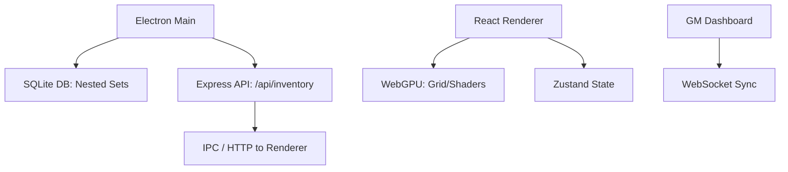

# Architecture

## Overview

Electron main process hosts the local REST API and SQLite DB (Nested Set Model). The renderer is a Vite-bundled React app with Tailwind; WebGPU is enabled for future grid/shaders. State is managed with Zustand; GM sync is planned via WebSocket.

## Topology

## Components

| Component    | Role                                      |
|-------------|-------------------------------------------|
| Main        | Window, preload, IPC; starts API and DB  |
| API         | Express on port 38462; CRUD for items    |
| DB          | SQLite in userData; Nested Set (left/right) |
| Renderer    | React + Tailwind; grid, alchemy, pages   |
| Shared      | Item types, grid placement logic         |

## DB Model

**Nested Set:** Each item has `left` and `right` integer markers. Descendants have `left`/`right` strictly between parent’s. Enables subtree queries with range conditions.

## Glossary

- **Nested Set** — Hierarchy model using left/right markers for efficient subtree queries.
- **WebGPU** — Low-level GPU API for Tahoe/Metal; used for grid and effects.
