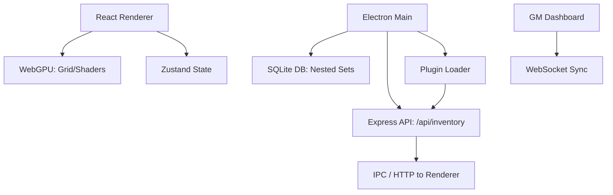
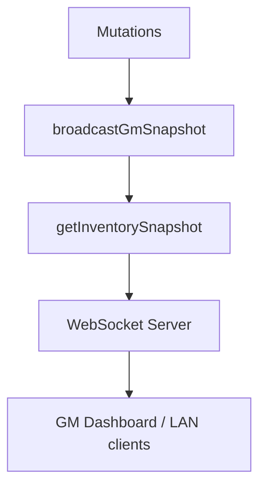
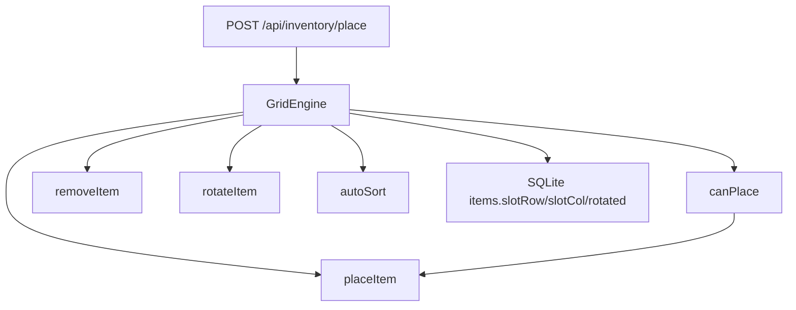
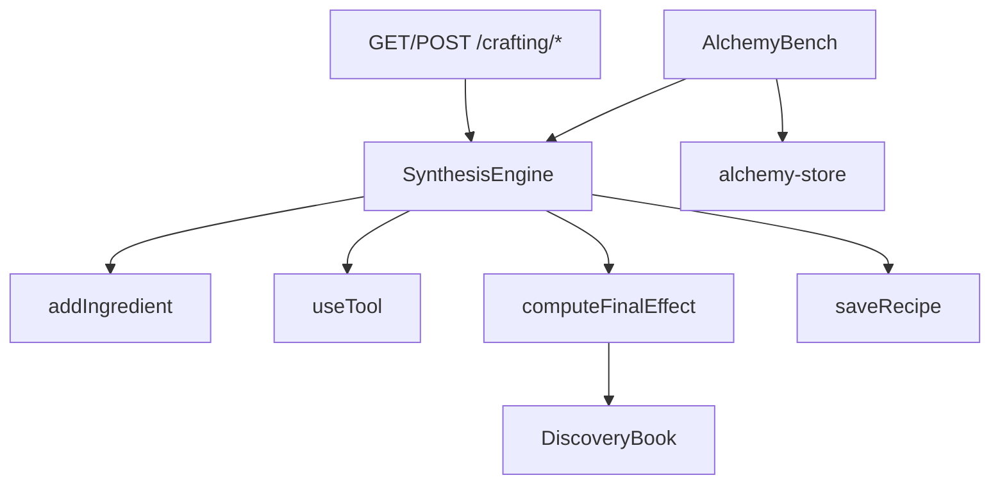
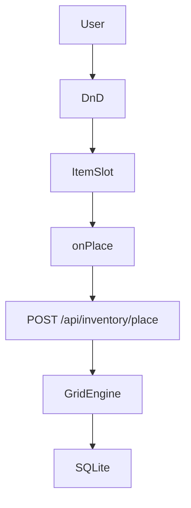

# Architecture

## Overview

Electron main process hosts the local REST API and SQLite DB (Nested Set Model). The renderer is a Vite-bundled React app with Tailwind; WebGPU is enabled for grid/shaders. State is managed with Zustand; GM sync runs over WebSocket (port 38463). Plugins load from userData/plugins via ESM dynamic import.

## Topology



## World View (Phase 4)

**Multi-Location Hub:** Locations (Person, Ship's Cabin, Town Apartment) are seeded in migration **004_seed_world_locations.sql**. **GET /locations** returns the list; **GET /character/inventory** returns the full tree per location. **WorldView** (renderer) shows location tabs and, per selected location, containers and **GridWithDnD**; placement uses **POST /api/inventory/place** with the chosen container. **world-store** (Zustand) holds selectedLocationId.

## GM WebSocket Sync (Phase 4)

**gm-sync.ts** (main): WebSocket server on port **38463**. On connection, sends a **snapshot** (tree + equipped) from **getInventorySnapshot()**. After mutations (place, equip, POST /api/inventory), **broadcastGmSnapshot()** pushes the latest snapshot to all connected clients. **GMDashboard** (renderer tab): connects to ws://127.0.0.1:38463, displays last snapshot (locations, container counts, equipped count). Snapshot model: broadcast only when state changes.



## Plugin Loader (Phase 4)

**PluginManifest** (shared/types): name, version, apiVersion, main (optional entry file). Plugins live in **userData/plugins/**; each plugin is a directory with **manifest.json** or **package.json** (with a "plugin" field) and an ESM entry (default **index.js**). **loadPlugins(pluginsDir, expressApp)** (main/plugins/loader.ts): reads dir, dynamic-imports each plugin entry via **pathToFileURL**, calls **register(api)**. **PluginAPI**: **registerHook(event, handler)** and **app** (Express). Hooks: **onItemCreate** (called after POST /api/inventory). **emit(event, ...args)** runs all handlers for an event. Only userData/plugins is loaded; no eval.

## Components

| Component    | Role                                      |
|-------------|-------------------------------------------|
| Main        | Window, preload, IPC; starts API and DB  |
| API         | Express on port 38462; CRUD for items    |
| DB          | SQLite in userData; Nested Set (left/right) |
| Renderer    | React + Tailwind; grid, alchemy, World View, GM Dashboard |
| Shared      | Item types, grid placement logic, PluginManifest         |
| GM Sync     | WebSocket server (38463); snapshot broadcast              |
| Plugins     | ESM loader from userData/plugins; API hooks               |

## Grid Engine

Volumetric (Tetris-style) grid is managed by **GridEngine** in `src/shared/gridEngine.ts`: 2D boolean array for slot occupancy, `canPlace` / `placeItem` / `removeItem` with rotation (90° CCW), and `autoSort` (bottom-left packing). API: **POST /api/inventory/place** (itemId, containerId, slotRow, slotCol, rotated) validates via GridEngine before updating DB.



## Alchemy (Phase 3)

**SynthesisEngine** (src/shared/synthesisEngine.ts): Vector-based Coordinate Grid Synthesis. Base liquid (water/oil/mercury) sets initial position; ingredients add vectors; tools (alembic = double position, mortar = round to cardinal). **computeFinalEffect()** returns potion name and effect nodes by proximity to DEFAULT_EFFECT_NODES (healing, poison, haste, resist). **Discovery Book** stored as JSON in userData/crafting/discoveryBook.json; API: **GET /crafting/recipes**, **POST /crafting/synthesize** (baseLiquid, ingredients), **POST /crafting/recipes** (save recipe). **AlchemyBench** (renderer): DnD cauldron, UNDERDARK_INGREDIENTS chips, Brew/Save recipe; **alchemy-store** (Zustand) holds baseLiquid, ingredients, lastResult.



## DB Model

**Nested Set:** Each item has `left` and `right` integer markers. Descendants have `left`/`right` strictly between parent’s. Enables subtree queries with range conditions. Items also have **slotRow**, **slotCol**, **rotated** for grid placement.

## Glossary

- **Nested Set** — Hierarchy model using left/right markers for efficient subtree queries.
- **WebGPU** — Low-level GPU API for Tahoe/Metal; used for grid and Liquid Glass effects.
- **GridEngine** — 2D slot occupancy and placement (canPlace, placeItem, rotateItem, autoSort).
- **SynthesisEngine** — Vector-based alchemy (addIngredient, useTool, computeFinalEffect, Discovery Book).
- **Discovery Book** — JSON file (userData/crafting/discoveryBook.json) of discovered recipes.
- **PluginManifest** — name, version, apiVersion, main; declares ESM plugin for userData/plugins.
- **Snapshot (sync)** — State (tree + equipped) broadcast to GM clients only when changes occur.

## WebGPU

Renderer uses **InventoryCanvas** to init WebGPU: requestAdapter → requestDevice → configure context (alphaMode: premultiplied for Tahoe translucency) → createShaderModule(liquidGlass.wgsl) → createRenderPipelineAsync → render loop (clear, draw full-screen quad). Shader: vertex outputs position/UV; fragment returns translucent glass color. Context isolation prevents GPU buffer exploits.

## Drag-and-Drop

**GridWithDnD** wraps the grid in **DndProvider** (HTML5Backend). **ItemSlot** uses useDrop (accept: item, onPlace(row, col)) and useDrag (when slot is origin of an item). On drop, renderer calls **POST /api/inventory/place** (itemId, containerId, slotRow, slotCol, rotated), then refetches **GET /character/inventory**.



## Phase 5: Data Model Update (GURPS)

**ItemDefinitions** and **ItemInstances** (adjacency list): migration **005_gurps_tables.sql**. **item_definitions**: name, weight, volume, tl, lc, malf. **item_instances**: def_id, parent_id, quantity, quality, state, condition. **attachments**: parent_id, slot_type (MOLLE/Rail/Holster). **containers**: added **volume_limit**. **queries.ts**: **getSubtreeWeightRecursive(parentId)** uses a Recursive CTE to sum descendant weight (def.weight * instance.quantity). Shared types: **ItemDefinition**, **ItemInstance**, **Attachment**.

```mermaid
graph TD
  ItemInstances --> Recursive CTE
  ItemDefinitions --> Recursive CTE
  Recursive CTE --> TotalWeight
```

## Phase 5: PALS/MOLLE and Loadout Presets

**GridEngine**: **attachPouch(pouch, vest, rows[], cols[])** returns **{ integrity }** (1.0 if &gt;2 strap points, else 0.5). **savePreset(name, items)** / **loadPreset(name)** in-memory (loadout presets). **POST /inventory/attach** (pouchId, vestId, slots { rows, cols }) validates and returns integrity. **GridWithDnD**: Weave Mode hint (hotkey W) for PALS straps.

## Metal Bridge (Phase 5)

**WebGPU** remains the primary render path (InventoryCanvas + liquidGlass.wgsl). A native **Metal 4** bridge (Swift/Objective-C++ addon via node-addon-api) for 3D gear preview and Liquid Glass depth is optional; implementation would embed an MTKView in an Electron child window. If the native addon is deferred, WebGPU continues as the fallback. No new native addon code in this phase.

## Phase 5: Alchemy Refining and State-Based Brewing

**alchemyEngine.ts**: **refineReagent(reagent, skill)** returns **{ purity }** (GURPS-style roll; purity += 0.2 on success). **startBrew(recipe, timeMs)**, **getBrewStatus()** (state: preparation | active | refinement | completion), **setBrewAttendHours**, **clearBrew**. **Reagents** table (006_reagents.sql): name, purity, potency. API: **POST /crafting/refine** (reagent, skill), **GET /crafting/status**, **POST /crafting/brew/start**, **POST /crafting/brew/attend**, **POST /crafting/brew/clear**.

## Phase 5: GM Command API

**gm.ts**: **POST /gm/injectItem** (name, width?, height?, containerId?) — inserts item, broadcasts snapshot, emits onItemCreate and **onWeightChange**. **POST /gm/modifyState** (itemId, state { equipmentSlot? }) — updates item state, broadcasts snapshot, emits onWeightChange. BYOEF hooks: **onWeightChange** for encumbrance plugins. API is **localhost-only** (see SECURITY.md).
