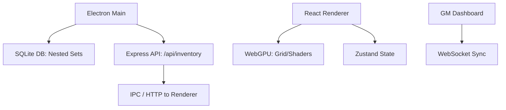
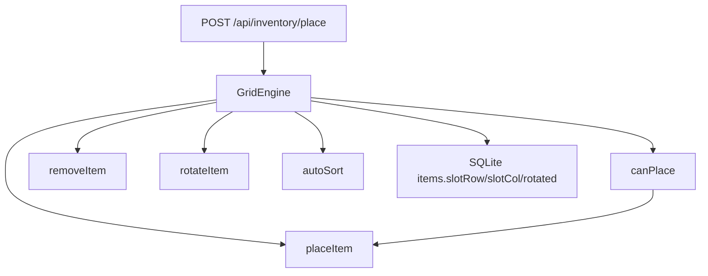
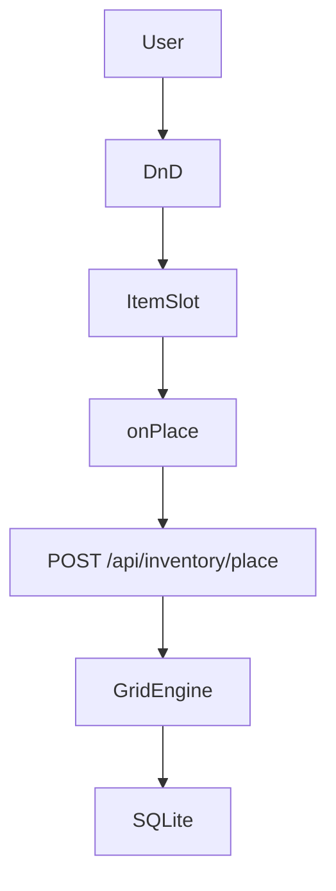

# Architecture

## Overview

Electron main process hosts the local REST API and SQLite DB (Nested Set Model). The renderer is a Vite-bundled React app with Tailwind; WebGPU is enabled for future grid/shaders. State is managed with Zustand; GM sync is planned via WebSocket.

## Topology

## Components

| Component    | Role                                      |
|-------------|-------------------------------------------|
| Main        | Window, preload, IPC; starts API and DB  |
| API         | Express on port 38462; CRUD for items    |
| DB          | SQLite in userData; Nested Set (left/right) |
| Renderer    | React + Tailwind; grid, alchemy, pages   |
| Shared      | Item types, grid placement logic         |

## Grid Engine

Volumetric (Tetris-style) grid is managed by **GridEngine** in `src/shared/gridEngine.ts`: 2D boolean array for slot occupancy, `canPlace` / `placeItem` / `removeItem` with rotation (90° CCW), and `autoSort` (bottom-left packing). API: **POST /api/inventory/place** (itemId, containerId, slotRow, slotCol, rotated) validates via GridEngine before updating DB.

## DB Model

**Nested Set:** Each item has `left` and `right` integer markers. Descendants have `left`/`right` strictly between parent’s. Enables subtree queries with range conditions. Items also have **slotRow**, **slotCol**, **rotated** for grid placement.

## Glossary

- **Nested Set** — Hierarchy model using left/right markers for efficient subtree queries.
- **WebGPU** — Low-level GPU API for Tahoe/Metal; used for grid and Liquid Glass effects.
- **GridEngine** — 2D slot occupancy and placement (canPlace, placeItem, rotateItem, autoSort).

## WebGPU

Renderer uses **InventoryCanvas** to init WebGPU: requestAdapter → requestDevice → configure context (alphaMode: premultiplied for Tahoe translucency) → createShaderModule(liquidGlass.wgsl) → createRenderPipelineAsync → render loop (clear, draw full-screen quad). Shader: vertex outputs position/UV; fragment returns translucent glass color. Context isolation prevents GPU buffer exploits.

## Drag-and-Drop

**GridWithDnD** wraps the grid in **DndProvider** (HTML5Backend). **ItemSlot** uses useDrop (accept: item, onPlace(row, col)) and useDrag (when slot is origin of an item). On drop, renderer calls **POST /api/inventory/place** (itemId, containerId, slotRow, slotCol, rotated), then refetches **GET /character/inventory**.

